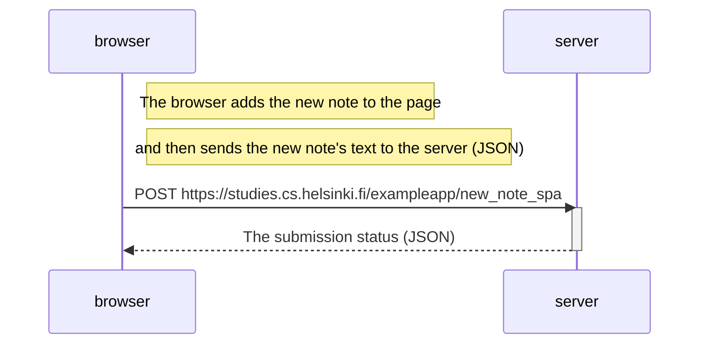

```mermaid
sequenceDiagram
    participant browser
    participant server

    Note right of browser: The browser adds the new note to the page
    Note right of browser: and then sends the new note's text to the server (JSON)

    browser->>server: POST https://studies.cs.helsinki.fi/exampleapp/new_note_spa
    activate server
    server-->>browser: The submission status (JSON)
    deactivate server
```
